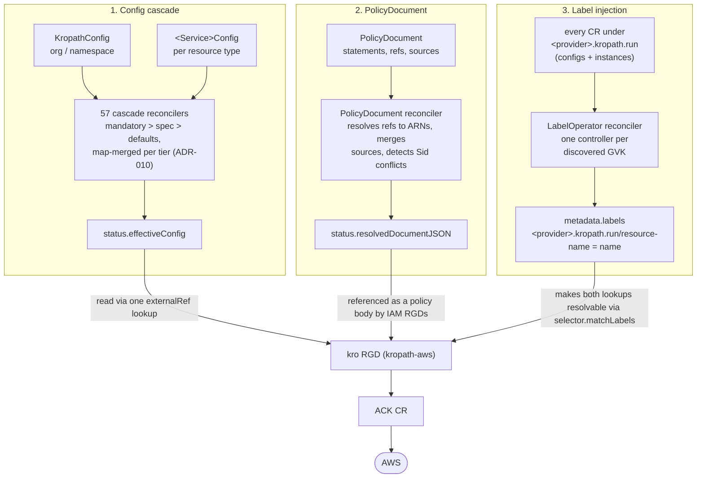

# kropath-controller

[](https://github.com/kropath/kropath-controller/actions/workflows/ci.yaml)
[](https://github.com/kropath/kropath-controller/actions/workflows/release.yaml)
[](LICENSE)

Go controller for [kropath](https://github.com/kropath) (kro + golden path), a multi-cloud golden
path platform. `kropath-controller` is a multi-reconciler `kropath-operator` binary built on a
single `controller-runtime` Manager — one Reconciler struct per feature.

It is the **config-resolution half** of kropath: it watches the governance CRs a platform team
writes (`KropathConfig` and per-service `<Service>Config`), merges the layers under a strict
`mandatory > spec > defaults` precedence, and writes a single `status.effectiveConfig` object.
The kro ResourceGraphDefinitions in [kropath-aws](https://github.com/kropath/kropath-aws) read
that object through one `externalRef` lookup per RGD and project it onto ACK resources.

> ### ⚠️ EXPERIMENTAL
>
> **This project is under active development and is not production-ready.** CRD schemas,
> `status.effectiveConfig` shapes, and reconciler behaviour may change without notice, and there
> are no compatibility guarantees between releases.
>
> CI runs unit tests and Chainsaw integration tests against a local
> [kind](https://kind.sigs.k8s.io/) cluster with the operator running out-of-cluster. No AWS
> account or credentials are involved, and no ACK controllers are installed. **Integration
> testing against a live AWS environment is currently in progress and runs outside CI**, so
> cloud-side behaviour is not yet covered by the automated suite in this repository.

---

## How it works

kropath-controller ships **three independent features**. They share a deployment, a `/metrics`
endpoint, and a leader election lease — but not a code path. Each has its own reconcile loop,
its own inputs, and its own output field.



**1. Config cascade (57 reconcilers).** Each watches its `<Service>Config` plus `KropathConfig`,
runs the merge helper in `internal/cascade`, and writes `status.effectiveConfig` (ADR-010). The
merge is map-based and last-writer-wins per tier, so `mandatory` always beats a user's `spec`.
This is the only feature that produces `effectiveConfig`.

**2. PolicyDocument.** A distinct reconciler with a distinct CRD and output. It resolves
`spec.statements[].principals[].ref` / `.resources[].ref` to ARNs (preferring
`status.predictedArn`, falling back to `status.arn`), concatenates statement arrays from
`spec.sources` left-to-right, detects `Sid` collisions, and writes
`status.resolvedDocumentJSON`. It sets `Ready`, `SidConflict`, and `SourceNotReady` conditions.
A raw `spec.documentJSON` is validated and passed through unmerged.

**3. Label injection** ([spec](https://github.com/kropath/kropath-core/blob/main/docs/specs/controller-label-operator.md),
cycle `ctrl-label-op-01`). Orthogonal to config resolution: it makes provider resources
*discoverable*. It discovers every kind under `aws.`/`gcp.`/`azure.kropath.run` and runs one
controller per GVK, ensuring `<provider>.kropath.run/resource-name` always equals
`metadata.name`. Without it, the RGDs' `selector.matchLabels` lookups silently fail to resolve —
which is why features 1 and 2 both depend on it, and why it is an operator rather than a
mutating webhook (it repairs resources created before deployment or during an outage).

All reconcilers are always enabled. Feature availability is determined by which image version is
deployed, not by runtime flags — query `/features` or the generated
[`docs/features.yaml`](docs/features.yaml) to see what a given image contains.

## Implementation status

**61 reconcilers**, **58 CRD types** registered in `api/v1alpha1`, **61 Chainsaw suites**
covering **493 steps**, and **91 Go test files**.

**Suite** is the Chainsaw suite under `tests/`; **Steps** counts its named steps.
**AWS integration** tracks end-to-end validation against a live AWS account with real ACK
controllers, exercised outside this repo's CI in the separate `kropath-aws-integration-tests`
harness. That harness maintains live resource fixtures backed by `S3Config`, `SNSConfig`, and
`SQSConfig`, and has confirmed the `LambdaConfig` cascade reconciles against a real cluster, but the
only fully-investigated resource run so far surfaced a real, still-open reconciliation bug, so no
config kind has a confirmed, clean, end-to-end passing result and every entry below is still
`⏳ Pending`.

### Feature 1 — config cascade (57 reconcilers)

Each writes `status.effectiveConfig` on its `<Service>Config` CR.

| Reconciler | CR(s) watched | Suite | Steps | AWS integration |
|---|---|---|---|---|
| `ACMConfig` | `ACMConfig`, `KropathConfig` | `acm/ctrl-acm` | 3 | ⏳ Pending |
| `APIGatewayConfig` | `APIGatewayConfig`, `KropathConfig` | `apigateway/ctrl-apigw-01` | 6 | ⏳ Pending |
| `ApiGatewayV2Config` | `ApiGatewayV2Config`, `KropathConfig` | `apigatewayv2/ctrl-apigwv2-01` | 10 | ⏳ Pending |
| `AppScalingConfig` | `AppScalingConfig`, `KropathConfig` | `appscaling/ctrl-appscaling-01` | 4 | ⏳ Pending |
| `AthenaConfig` | `AthenaConfig`, `KropathConfig` | `athena/ctrl-athena-01` | 9 | ⏳ Pending |
| `AutoScalingConfig` | `AutoScalingConfig`, `KropathConfig` | `autoscaling/ctrl-autoscaling-01` | 9 | ⏳ Pending |
| `BackupConfig` | `BackupConfig`, `KropathConfig` | `backup/ctrl-backup-01` | 2 | ⏳ Pending |
| `BedrockConfig` | `BedrockConfig`, `KropathConfig` | `bedrock/ctrl-bedrock-01` | 24 | ⏳ Pending |
| `CloudFrontConfig` | `CloudFrontConfig`, `KropathConfig` | `cloudfront/ctrl-cloudfront-01` | 7 | ⏳ Pending |
| `CloudTrailConfig` | `CloudTrailConfig`, `KropathConfig` | `cloudtrail/ctrl-ct-01` | 1 | ⏳ Pending |
| `CloudWatchConfig` | `CloudWatchConfig`, `KropathConfig` | `cloudwatch/ctrl-cw-01` | 11 | ⏳ Pending |
| `CloudWatchLogsConfig` | `CloudWatchLogsConfig`, `KropathConfig` | `cloudwatchlogs/ctrl-cwl-01` | 11 | ⏳ Pending |
| `CodeArtifactConfig` | `CodeArtifactConfig`, `KropathConfig` | `codeartifact/ctrl-codeartifact-01` | 3 | ⏳ Pending |
| `CognitoConfig` | `CognitoConfig`, `KropathConfig` | `cognito/ctrl-cognito` | 5 | ⏳ Pending |
| `DocumentDBConfig` | `DocumentDBConfig`, `KropathConfig` | `documentdb/ctrl-docdb-01` | 4 | ⏳ Pending |
| `DSQLConfig` | `DSQLConfig`, `KropathConfig` | `dsql/ctrl-dsql-01` | 4 | ⏳ Pending |
| `DynamoDBConfig` | `DynamoDBConfig`, `KropathConfig` | `dynamodb/ctrl-dynamodb-01` | 14 | ⏳ Pending |
| `EC2Config` | `EC2Config`, `KropathConfig` | `ec2/ctrl-ec2-01` | 15 | ⏳ Pending |
| `ECRConfig` | `ECRConfig`, `KropathConfig` | `ecr/ctrl-ecr-01` | 23 | ⏳ Pending |
| `ECRPublicConfig` | `ECRPublicConfig`, `KropathConfig` | `ecrpublic/controller/ctrl-ecrpub-01` | 6 | ⏳ Pending |
| `ECSConfig` | `ECSConfig`, `KropathConfig` | `ecs/ctrl-ecs-01` | 4 | ⏳ Pending |
| `EFSConfig` | `EFSConfig`, `KropathConfig` | `efs/ctrl-efs-01` | 10 | ⏳ Pending |
| `EKSConfig` | `EKSConfig`, `KropathConfig` | `eks/ctrl-eks-01` | 16 | ⏳ Pending |
| `ELBConfig` | `ELBConfig`, `KropathConfig` | `elb/ctrl-elb-01` | 2 | ⏳ Pending |
| `ElastiCacheConfig` | `ElastiCacheConfig`, `KropathConfig` | `elasticache/ctrl-elasticache-01` | 13 | ⏳ Pending |
| `EMRConfig` | `EMRConfig`, `KropathConfig` | `emr/ctrl-emr-01` | 5 | ⏳ Pending |
| `EventBridgeConfig` | `EventBridgeConfig`, `KropathConfig` | `eventbridge/ctrl-eventbridge-01` | 10 | ⏳ Pending |
| `GlueConfig` | `GlueConfig`, `KropathConfig` | `glue/controller/ctrl-glue-01` | 6 | ⏳ Pending |
| `IAMConfig` | `IAMConfig`, `KropathConfig` | `iam/ctrl-iam-01` | 7 | ⏳ Pending |
| `KeyspacesConfig` | `KeyspacesConfig`, `KropathConfig` | `keyspaces/ctrl-keyspaces-01` | 6 | ⏳ Pending |
| `KinesisConfig` | `KinesisConfig`, `KropathConfig` | `kinesis/controller/ctrl-kinesis-01` | 4 | ⏳ Pending |
| `KMSConfig` | `KMSConfig`, `KropathConfig` | `kms/ctrl-kms-01`, `kms/ctrl-kms-02` | 18 | ⏳ Pending |
| `LambdaConfig` | `LambdaConfig`, `KropathConfig` | `lambda/ctrl-lambda-01` | 7 | ⏳ Pending |
| `ManagedPrometheusConfig` | `ManagedPrometheusConfig`, `KropathConfig` | `managedprometheus/controller` | 5 | ⏳ Pending |
| `MemoryDBConfig` | `MemoryDBConfig`, `KropathConfig` | `memorydb/ctrl-memorydb-01` | 12 | ⏳ Pending |
| `MQConfig` | `MQConfig`, `KropathConfig` | `mq/ctrl-mq-01` | 12 | ⏳ Pending |
| `MSKConfig` | `MSKConfig`, `KropathConfig` | `msk/mskconfig/ctrl-msk-01` | 3 | ⏳ Pending |
| `MWAAConfig` | `MWAAConfig`, `KropathConfig` | `mwaa/ctrl-mwaa-01` | 2 | ⏳ Pending |
| `NetworkFirewallConfig` | `NetworkFirewallConfig`, `KropathConfig` | `networkfirewall/ctrl-nfw-01` | 11 | ⏳ Pending |
| `OpenSearchConfig` | `OpenSearchConfig`, `KropathConfig` | `opensearch/ctrl-opensearch-cascade` | 6 | ⏳ Pending |
| `OrganizationsConfig` | `OrganizationsConfig`, `KropathConfig` | `organizations/controller/ctrl-org-01` | 3 | ⏳ Pending |
| `PipesConfig` | `PipesConfig`, `KropathConfig` | `pipes/ctrl-pipes-01` | 2 | ⏳ Pending |
| `QuickSightConfig` | `QuickSightConfig`, `KropathConfig` | `quicksight/ctrl-qs-01` | 9 | ⏳ Pending |
| `RAMConfig` | `RAMConfig`, `KropathConfig` | `ram/ctrl-ram-01` | 2 | ⏳ Pending |
| `RDSConfig` | `RDSConfig`, `KropathConfig` | `rds/ctrl-rds-01` | 16 | ⏳ Pending |
| `RecycleBinConfig` | `RecycleBinConfig`, `KropathConfig` | `recyclebin/controller/ctrl-rb-01` | 4 | ⏳ Pending |
| `Route53Config` | `Route53Config`, `KropathConfig` | `route53/ctrl-r53-00` | 9 | ⏳ Pending |
| `S3AdvancedConfig` | `S3AdvancedConfig`, `KropathConfig` | `s3advanced/ctrl-s3advanced-01` | 9 | ⏳ Pending |
| `S3Config` | `S3Config`, `KropathConfig` | `s3/ctrl-s3-01` | 13 | ⏳ Pending |
| `SageMakerConfig` | `SageMakerConfig`, `KropathConfig` | `sagemaker/cascade/ctrl-sm-01` | 11 | ⏳ Pending |
| `SecretsManagerConfig` | `SecretsManagerConfig`, `KropathConfig` | `secretsmanager/ctrl-secretsmanager-01` | 15 | ⏳ Pending |
| `SESConfig` | `SESConfig`, `KropathConfig` | `ses/ctrl-ses-01` | 4 | ⏳ Pending |
| `SNSConfig` | `SNSConfig`, `KropathConfig` | `sns/ctrl-sns-01` | 13 | ⏳ Pending |
| `SQSConfig` | `SQSConfig`, `KropathConfig` | `sqs/ctrl-sqs-01` | 13 | ⏳ Pending |
| `SSMConfig` | `SSMConfig`, `KropathConfig` | `ssm/ctrl-ssm-cascade` | 3 | ⏳ Pending |
| `StepFunctionsConfig` | `StepFunctionsConfig`, `KropathConfig` | `stepfunctions/ctrl-sfn-01` | 11 | ⏳ Pending |
| `WAFConfig` | `WAFConfig`, `KropathConfig` | `waf/controller` | 4 | ⏳ Pending |

### Features 2 and 3 — standalone reconcilers

Neither reads or writes `effectiveConfig`; both are separate features with their own outputs.

| Feature | Reconciler | CR(s) watched | Output | Suite | Steps | AWS integration |
|---|---|---|---|---|---|---|
| PolicyDocument | `PolicyDocument` | `PolicyDocument`, `KropathConfig` | `status.resolvedDocumentJSON` | `policy/phase2-refs`, `policy/phase3-merge` | 11 | ⏳ Pending |
| Label injection | `LabelOperator` | every kind under `aws.`/`gcp.`/`azure.kropath.run` | `metadata.labels[<provider>.kropath.run/resource-name]` | `label-operator/ctrl-label-op-01` | 8 | ⏳ Pending |

Both are implemented and covered. The label-operator suite has a step for AC-1 … AC-8 of the
[spec](https://github.com/kropath/kropath-core/blob/main/docs/specs/controller-label-operator.md)
(label added for AWS config, GCP config and non-config kinds; wrong value corrected; correct
value is a no-op; resource still admitted while the operator is down; retroactive labelling on
recovery; core `kropath.run` group excluded); AC-9 is not yet covered — see
[Known gaps](#known-gaps). The PolicyDocument suites
cover ref resolution (`phase2-refs`) and source merging with `Sid` conflict detection
(`phase3-merge`). See [Known gaps](#known-gaps) for the deviations from spec that remain.

Two further suites cover the binary rather than a reconciler: `features/ctrl-features-01` (5
steps) exercises the `/features` endpoint and `version/ctrl-version-01` (2 steps) the build-info
metrics.

`docs/features.yaml` is generated from the registry by `make features-gen` and CI fails if it
drifts from the code (the **Feature registry drift gate** job).

### Known gaps

- ~~**Eight reconcilers have no Chainsaw suite.**~~ Fixed (KRO-1259). `ELBConfig`,
  `AppScalingConfig`, `CodeArtifactConfig`, `DocumentDBConfig`, `MWAAConfig`, `PipesConfig`,
  `RAMConfig`, and `SESConfig` each now have a `tests/<service>/` suite and a `test-<service>`
  root Make target (see the Feature 1 table above), wired into `make test-chainsaw`. Coverage is
  the effectiveConfig cascade merge only — the CRD-level `x-kubernetes-validations` acceptance
  criteria in each resource's spec are covered in `kropath-aws`, not here. `ELBConfig`'s suite
  installs its own CRD from `tests/fixtures/crds-optional/` as an idempotent first step (see
  `docs/troubleshooting-logs/2026-08-13-elbconfig-missing-crd-manager-crash.md` for why that CRD
  is optional in the first place), so `make test-elb` is self-sufficient and does not depend on
  `ctrl-dyn-01/02/03` having run first.

  Three of the eight resources' specs (`aws-elb-01-elbconfig.md`, `aws-mwaa-01-mwaaconfig.md`,
  `aws-pipes-01-pipesconfig.md`) document the effectiveConfig cascade merge in their Schema
  Surface / Context sections but — unlike every sibling `*Config` spec — never enumerate it as a
  numbered Acceptance Criterion. The new suites for those three test the documented behavior
  directly under descriptive step names rather than invented AC numbers; flagged to Spec Analyst
  as a spec gap worth a follow-up amendment.
- ~~**`make test-apigateway` is missing from the root `Makefile`.**~~ Fixed (KRO-1259). Added,
  matching the existing `test-apigatewayv2` pattern.
- **`make test-chainsaw`'s "remaining suites" list is itself missing several existing suites**
  (`cloudfront`, `cloudtrail`, `cognito`, `bedrock`, `sagemaker`, `opensearch`, `dsql`, `ssm`,
  `keyspaces`, `quicksight`, `networkfirewall`, `backup`, `managedprometheus`, `recyclebin`,
  `route53`, `lambda`, `ecrpublic`, `kinesis`, `mq`, `msk`, `glue`, `athena`, `emr`, `acm`,
  `dynamodb`) — each has its own `test-<service>` target and passes standalone, but
  `make test-chainsaw` (the CI gate) never runs them. Discovered while adding the eight suites
  above; out of scope for this fix since it is a pre-existing, unrelated drift in the "run
  everything" target rather than a missing suite. Worth its own follow-up ticket.

### Label injection — deviations from spec

The feature is implemented and AC-1 … AC-8 all have passing steps. Two details differ from
[`controller-label-operator.md`](https://github.com/kropath/kropath-core/blob/main/docs/specs/controller-label-operator.md),
and one acceptance criterion has no step yet:

- **New CRDs are not picked up until restart.** The spec says "any new CRD registered under
  these API groups — the operator automatically covers it without code changes". `Setup()`
  enumerates GVKs once via a discovery call at startup and registers one controller per kind, so
  a CRD created later (notably a kro-generated resource CRD) is not watched until the pod
  restarts. RBAC already uses `resources: ["*"]`, so only the discovery is startup-bound.
- **Only `v1alpha1` is watched.** `setupGroup` requests `<group>/v1alpha1` explicitly; a future
  `v1beta1`/`v1` under the same group would be ignored.
- **AC-9 has no Chainsaw step.** Scope is decided by API group alone, so the **provider-scoped**
  `KropathConfig` that `api/v1alpha1/register.go` registers under `aws.kropath.run` is
  deliberately in scope and does get labelled — the spec was amended to state this explicitly and
  added AC-9 to cover it. Only the **core** `KropathConfig` in the `kropath.run` group is
  excluded, which is what the existing AC-8 step asserts against
  (`tests/fixtures/crds/kropathconfig-core.yaml`). The behaviour is correct; the coverage for
  the in-scope half of the pair is missing.

### PolicyDocument — undocumented gap

`CLAUDE.md` states the reconciler "exposes Prometheus metrics: `kropath_poldoc_reconcile_total`,
`kropath_poldoc_unresolved_refs`, etc." **No such metrics exist** — the only registered metrics
are the build-info and feature-enabled gauges in `internal/version/metrics.go`. `CLAUDE.md` also
describes `tests/policy/` as "three phases (CRD validation, ref resolution, source merge)";
only `phase2-refs` and `phase3-merge` are present.

## Requirements

| Tool | Version | Notes |
|---|---|---|
| [Go](https://go.dev/dl/) | 1.26.6 | pinned in `go.mod`; keep in sync with `Makefile` and `.github/workflows/ci.yaml` |
| [kind](https://kind.sigs.k8s.io/) | v0.25.0 | local integration-test cluster |
| [Chainsaw](https://kyverno.github.io/chainsaw/) | v0.2.15 | integration test runner |
| [golangci-lint](https://golangci-lint.run/) | v2.11.4 | |
| Docker | — | container image build |

Install the pinned tool versions with:

```bash
make install-tools
```

## Building

```bash
make build           # compile bin/kropath-operator
make docker-build    # build the container image (tag = short git SHA + latest)
```

## Running locally

```bash
./bin/kropath-operator \
  --metrics-bind-address=:8080 \
  --health-probe-bind-address=:8081
```

| Flag | Default | Description |
|---|---|---|
| `--metrics-bind-address` | `:8080` | Prometheus `/metrics` endpoint |
| `--health-probe-bind-address` | `:8081` | `/healthz` and `/readyz` endpoints |

All reconcilers start automatically. The manager runs with leader election on by default
(`LEADER_ELECTION_NAMESPACE` or `POD_NAMESPACE` selects the lease namespace; defaults to
`default`).

## `/features` endpoint

`GET /features` on the metrics listener (`:8080`) returns version metadata and the live
reconciler list as JSON:

```bash
curl http://localhost:8080/features
```

```json
{
  "version": "v0.1.0",
  "gitCommit": "a1b2c3d",
  "buildDate": "2026-08-13T00:00:00Z",
  "goVersion": "go1.26.6",
  "features": [
    {
      "name": "IAMConfig",
      "package": "iamconfig",
      "description": "Reconciles IAMConfig CRs and propagates effective config.",
      "kinds": ["IAMConfig", "KropathConfig"],
      "sinceVersion": "v0.0.1",
      "stability": "stable"
    }
  ]
}
```

Filter by package name with `?name=<package>`:

```bash
# Returns the single kmsconfig entry or HTTP 404 if unknown.
curl 'http://localhost:8080/features?name=kmsconfig'
```

Only `GET` and `HEAD` are accepted; any other method returns `405`.

### `kropath-operator features` subcommand

Prints the same JSON as `GET /features` and exits — no kubeconfig or cluster connection needed.
Useful for inspecting an image before deploying it:

```bash
docker run --rm ghcr.io/kropath/kropath-controller:v0.1.0 features
```

or locally:

```bash
./bin/kropath-operator features | jq '.features | length'
```

## ACK install conformance check

kropath resolves `effectiveConfig.aws.accountId`/`.region` by reading the namespace annotations
ACK's own CARM feature already honours (ADR-015 §5.8). kropath and ACK are two independent
resolvers of the same placement question, and they agree only when the ACK install satisfies five
preconditions (ADR-015 §5.8.4) — kropath has no way to verify any of them from inside a reconcile
loop. `cmd/conformance-check` is a standalone, read-only CLI that inspects an existing install and
reports which preconditions hold:

```bash
go run ./cmd/conformance-check --ack-namespace ack-system
go run ./cmd/conformance-check --ack-namespace ack-system --namespaces payments-prod,data-prod
go run ./cmd/conformance-check --ack-namespace ack-system --output json
```

Exit codes: `0` — no blocking findings; `1` — at least one confirmed violation (or, with `--strict`,
at least one precondition the checker could not verify); `2` — the checker could not run at all.

This tool is not part of the `kropath-operator` image and is never invoked from the reconcile path —
it is a best-effort diagnostic for an operator to run before or after onboarding an account, not a
runtime gate (KRO-1141).

## Testing

```bash
make test            # unit tests, race detector
make test-cover      # unit tests + HTML coverage report
make lint            # go vet + golangci-lint (required before every commit)
make features-verify # fail if docs/features.yaml has drifted from the registry
```

### Integration tests (Chainsaw + kind)

```bash
make test-chainsaw   # kind-up → build → apply CRDs → start operator → run all suites → stop
```

To iterate on a single suite without restarting the operator:

```bash
make chainsaw-start chainsaw-wait
make test-iam        # one target per service — see `make help` for the full list
make chainsaw-stop
```

The operator runs **out-of-cluster** against the kind cluster; CRDs come from
`tests/fixtures/crds/`. On a failed run, clean up manually with `make chainsaw-stop kind-down`.

Suites follow the canonical **unique-resource-name-per-step** pattern — see
[`docs/frequent-chainsaw-errors.md`](docs/frequent-chainsaw-errors.md) before writing or fixing
one.

## Security scans

Run only after implementation is complete and the image has been built — not during active
development:

```bash
make security        # gosec (SAST) + govulncheck (dependency CVEs)
```

## CI

`.github/workflows/ci.yaml` runs on pull requests and on push to `main`, with two exceptions:

- **Chainsaw integration tests** run on pull requests only. A push to `main` runs lint, unit
  tests, feature-registry drift check, security scans, and the image build — it does not
  re-run Chainsaw against an identical tree that already passed on the PR head.
- **Markdown-only changes** skip the expensive work but still report. Every job starts and
  reports a `success`; a `changes` job diffs the PR against its merge base and, when nothing
  outside `*.md` moved, each downstream job skips its own steps.

The second point is load-bearing and easy to get wrong. The `main` ruleset requires the `Unit
tests` and `Chainsaw integration tests` contexts, and a required context is only satisfied by a
run that reports. Filtering at the trigger — `on.pull_request.paths-ignore: '**/*.md'` — stops
the workflow from starting at all, so those contexts are never reported and a docs-only PR sits
on "Expected — Waiting for status to be reported" with no way to merge it. Hence the path check
lives inside the jobs.

Two consequences worth knowing:

- Changing a job's `name:` renames its status context and silently un-satisfies the ruleset.
  `Unit tests` and `Chainsaw integration tests` are load-bearing strings.
- The path check fails open: a missing or all-zero base SHA (new branch, force push) runs the
  full suite rather than assuming docs-only.

On push to `main`, the image build publishes to `ghcr.io/kropath/kropath-controller` — see
[Image tags](#image-tags) for the full tag matrix.

`.github/workflows/pr-title.yaml` is a separate workflow so that it carries no path filter of its
own — a docs-only PR is exactly the case that must be typed correctly to stay out of a release.

## Releases

Releases are fully automated via [release-please](https://github.com/googleapis/release-please):

1. Merge a `feat(...)` or `fix(...)` PR to `main`.
2. release-please opens a release PR accumulating unreleased changes and proposing the next
   semver version.
3. A human reviews and merges the release PR.
4. Merging the release PR creates the git tag, the GitHub Release, and the `CHANGELOG.md` entry.
5. The tag triggers `release.yaml`, which builds and pushes the versioned image.

PRs are squash-merged, so the **PR title becomes the commit subject on `main`** and is the only
input release-please parses. Titles must be conventional commits with the ticket id as the scope:

```
feat(KRO-637): restore feature-registry metadata
fix(KRO-641): guard nil effectiveConfig on first reconcile
docs(KRO-650): document blocked_by metadata format
```

`pr-title.yaml` enforces this. The older `[KRO-637]: feat: …` form is rejected: the bracketed
prefix breaks the conventional-commit header regex, so the commit parses with no type, never bumps
the version, and never reaches `CHANGELOG.md`.

Which types cut a release:

| Type | Effect |
|---|---|
| `feat` | minor bump |
| `fix`, `perf`, `deps` | patch bump |
| `refactor`, `docs`, `test`, `build`, `ci`, `chore`, `revert` | **no release** |

`release.yaml` keeps its unfiltered push trigger, but release-please is a no-op on a run of
non-releasable commits — a batch of doc-only merges opens no release PR, so step 2 above never
fires and nothing is published.

Keep the type list in `pr-title.yaml` in sync with `changelog-sections` in
`release-please-config.json`.

### Image tags

| Trigger | Tags pushed |
|---|---|
| Push to `main` | `:latest`, `:sha-<short7>` |
| Release tag `vX.Y.Z` | `:vX.Y.Z`, `:sha-<short7>`, `:latest` |

## Repository layout

| Path | Contents |
|---|---|
| `api/v1alpha1/` | CRD Go types (23 kinds) + scheme registration — group `aws.kropath.run` |
| `cmd/manager/` | `main.go` — flag parsing, manager wiring, `features` subcommand |
| `cmd/gen-features/` | generates `docs/features.yaml` from the reconciler registry |
| `cmd/conformance-check/` | standalone CLI: checks an ACK/kro install against the CARM preconditions in ADR-015 §5.8.4 (KRO-1141) — not part of the `kropath-operator` image |
| `internal/reconciler/` | one package per reconciler (23 packages + `util`) |
| `internal/cascade/` | shared config-merge helpers, one file per service |
| `internal/carmcheck/` | ACK install conformance checks used by `cmd/conformance-check` |
| `internal/features/` | the feature registry and the `/features` HTTP handler |
| `internal/version/` | build-info and feature-enabled Prometheus metrics |
| `config/rbac/` | ClusterRole manifests for the manager, PolicyDocument, and LabelOperator |
| `tests/` | Chainsaw integration suites + `tests/fixtures/crds/` |
| `docs/` | engineering standards, the Chainsaw error catalog, and dated troubleshooting logs |

## Documentation

| Doc | Purpose |
|---|---|
| [`docs/STANDARDS.md`](docs/STANDARDS.md) | The engineering standards that bind this repo |
| [`docs/frequent-chainsaw-errors.md`](docs/frequent-chainsaw-errors.md) | Catalog of Chainsaw/controller test traps already hit — read before fixing a suite |
| [`docs/features.yaml`](docs/features.yaml) | Generated reconciler registry (do not edit by hand) |
| [`docs/troubleshooting-logs/`](docs/troubleshooting-logs/) | Dated per-incident fix logs |
| [`CLAUDE.md`](CLAUDE.md) | Repo conventions and working loop, for both humans and coding agents |

## Related repositories

| Repo | Role |
|---|---|
| [kropath-aws](https://github.com/kropath/kropath-aws) | kro RGDs and governance CRD manifests that consume `status.effectiveConfig` |

## Contributing

Bug fixes and small changes are welcome as pull requests. Feature requests and architectural
changes should be raised as a GitHub Issue — accepted requests go onto the development roadmap and
are implemented by the maintainers; feature PRs are not being accepted yet. See
[CONTRIBUTION.md](CONTRIBUTION.md).

## License

Apache License 2.0 — see [LICENSE](LICENSE).
